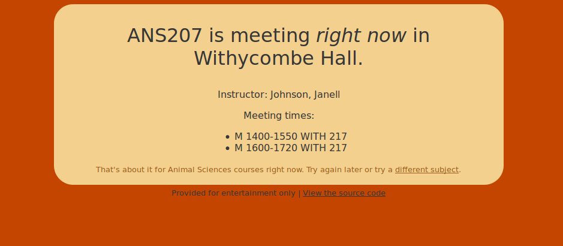

Classy
======

Classy is a simple [Flask][] app which demonstrates one
possible use of the Classes API.

Here's a screenshot:

[Flask]: http://flask.pocoo.org/

Installation
----

    git clone https://github.com/osu-mist/classy-demo.git
    virtualenv classy-demo
    cd classy-demo
    bin/pip install -e .

Configuration
----

Register an application to use the
Class Search API, Course Subjects API, and Terms API
at the [OSU Developer Portal][].

Create a file called config.py containing your Client ID 
and Client Secret.

    CLIENT_ID="yourclientid"
    CLIENT_SECRET="yourclientsecret"

[OSU Developer Portal]: https://developer.oregonstate.edu/

Testing
----

    % bin/python -m classy.tests

This will run the unit tests for Classy.

Running
----

    % CLASSY_CONFIG=../config.py bin/python -m classy

Note that the path to the configuration file in `CLASSY_CONFIG`
is relative to the package directory (./classy in this example).

BUGS
----

 * retrieves the full course list on every request; should add some caching
 * could be smarter about choosing random subjects and courses
 * doesn't understand that finals only meet during finals week
